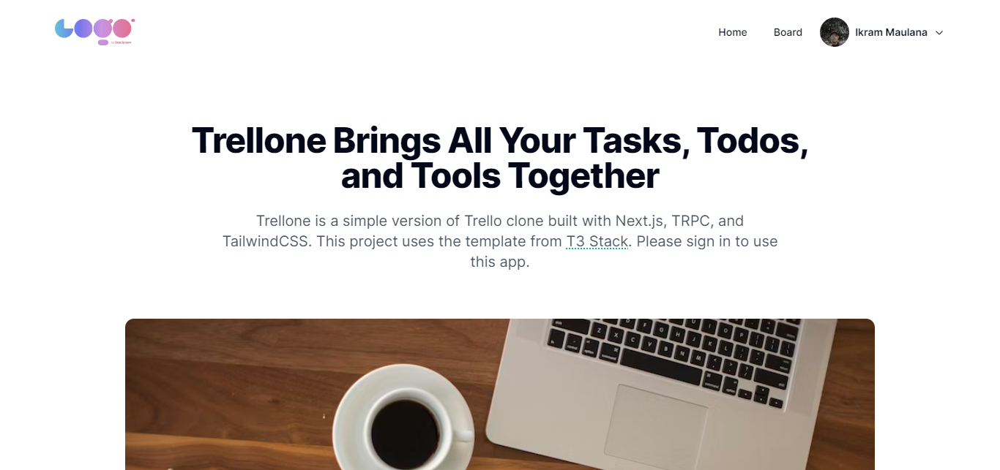

# Trellone

Trellone is a simple version of Trello clone built with Next.js, TRPC, and TailwindCSS. This project uses the template from T3 Stack.

Live example hosted on Vercel: [https://trellone.vercel.app/](https://trellone.vercel.app/)



## 🔑 Getting Google Client ID and Secret

To get Google Client ID and Secret, you need to create a new project on [Google Cloud Platform](https://console.cloud.google.com/). Then, go to [Google API Console](https://console.cloud.google.com/apis/credentials) and create new OAuth Client ID. After that, you can copy your Client ID and Secret.

## 🖥️ Running Locally

1. Clone this repo

   ```bash
   https://github.com/Ikram-Maulana/trellone.git
   ```

2. Install dependencies

   ```bash
   pnpm install
   ```

3. Add your `DATABASE_URL`, `NEXTAUTH_SECRET`, `GOOGLE_CLIENT_ID`, `GOOGLE_CLIENT_SECRET`, `UPLOADTHING_SECRET` and `UPLOADTHING_APP_ID` to your `.env` file

   ```bash
   DATABASE_URL=
   NEXTAUTH_SECRET=
   GOOGLE_CLIENT_ID=
   GOOGLE_CLIENT_SECRET=
   UPLOADTHING_SECRET=
   UPLOADTHING_APP_ID=
   ```

4. Run the development server

   ```bash
    pnpm dev
   ```

5. Open [http://localhost:3000](http://localhost:3000) with your browser to see the result

## 🚀 Deploy on Vercel

1. Fork this repo

2. Create new project on Vercel

3. Connect your repo to Vercel

4. Add your `DATABASE_URL`, `NEXTAUTH_SECRET`, `GOOGLE_CLIENT_ID`, `GOOGLE_CLIENT_SECRET`, `UPLOADTHING_SECRET` and `UPLOADTHING_APP_ID` to your Vercel project environment variables

5. Deploy your project
